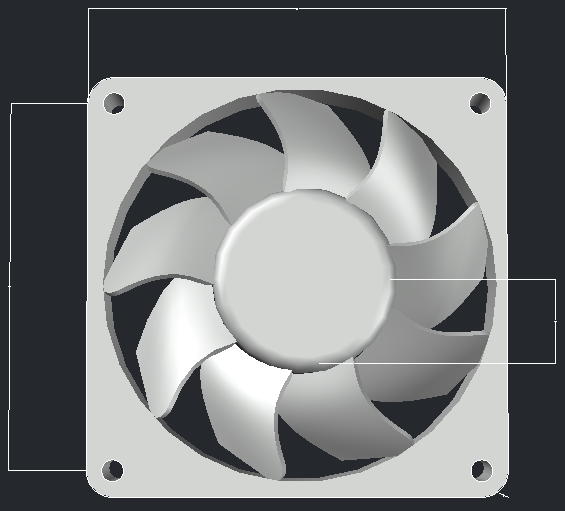
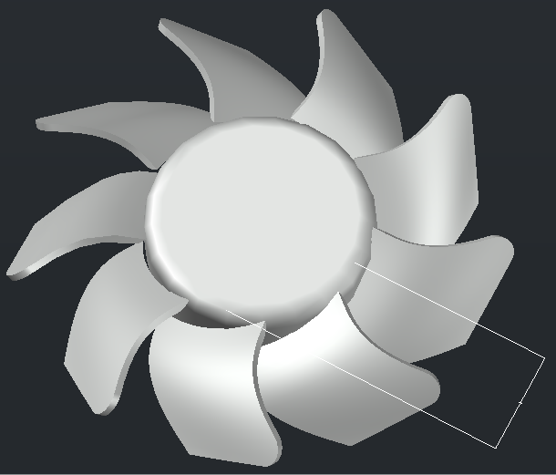
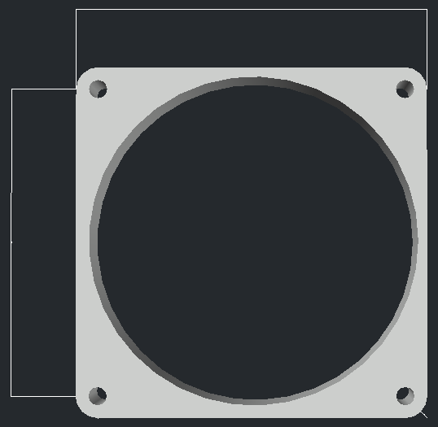
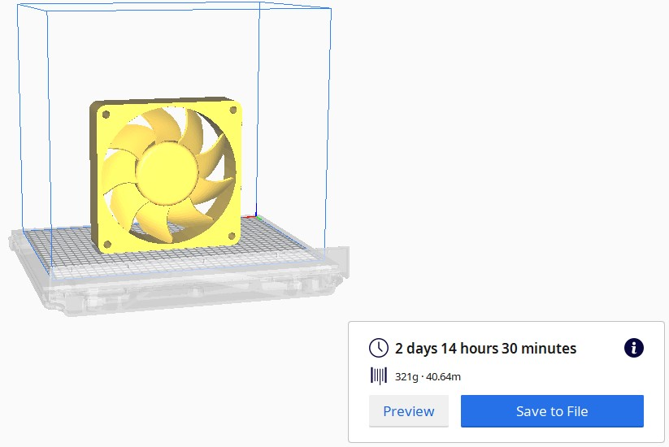
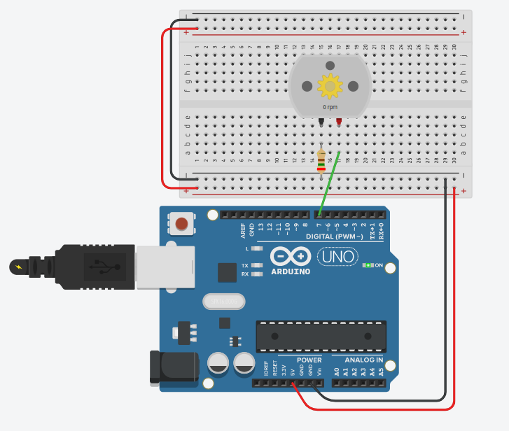
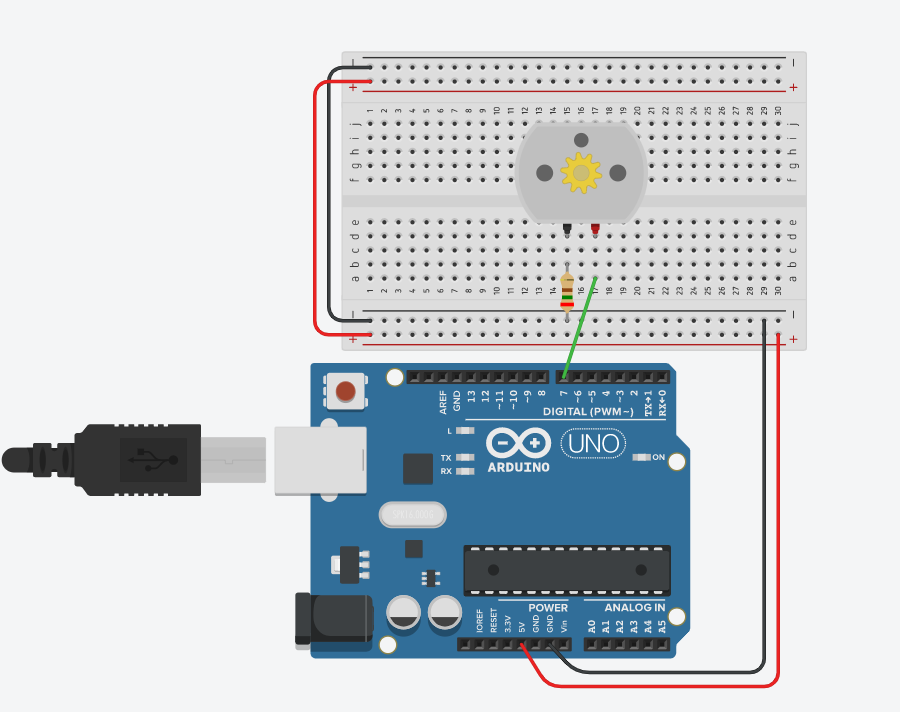

# Pc-Fan

### *Team Members*

- Asel Esra Ozyilmaz
- Selma Nezihoglu
- Gunduzalp Dogrutekin
- Osman Yasir Ozyilmaz

## Project Description

We have created a pc fan for active cooling. Fans are used to draw cooler air into the case from the outside, expel warm air from inside and move air across a heat sink to cool a particular component.
Our fan consists of two parts; inner part & outer part = **Fan & Case**
We have used ***AutoCad*** for the design of our fan and ***TinkerCad*** for our circuit.

`All the files needed could be found inside the cs209 folder. Like, STL files, the code, images(circuit, fan design, cura secreenshot), sources(.dwg, .brd).`

> Thingiverse link: https://www.thingiverse.com/thing:4359206

### *Design with Dimensions;*

  

> The fan is drawn with its dimensions; however, dimensions are so large that they can't be seen.

**Dimensions are: 184.0 × 47.0 × 184.0 mm**

### *Cura Secreenshot;*

### *Parts List & Circuit;*

**1. Stimulated circuit;**

**2. Circuit without stimulation**

 
